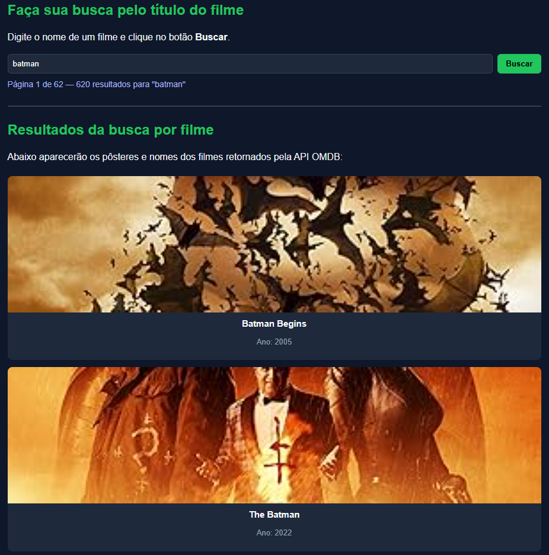
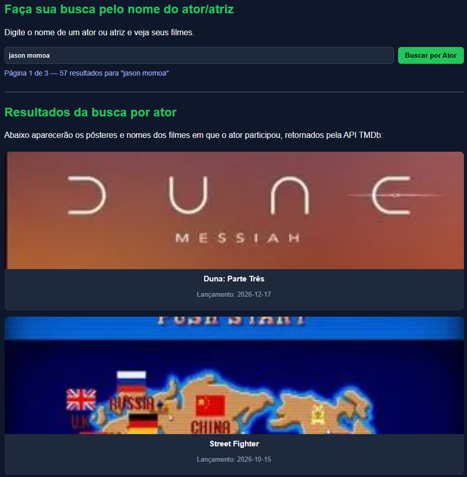

# 🎬 Busca de Filmes — Integração com OMDb e TMDb

Projeto desenvolvido por **Nathan Ferraz Liberatti** na disciplina de **Programação Web – 2º semestre (Senac)**.  
O objetivo é integrar duas APIs públicas de filmes **(OMDb e The Movie Database - TMDb)** utilizando **HTML, CSS e JavaScript**, reforçando práticas de consumo de APIs e manipulação do DOM.

---

## 🧠 Objetivo do Projeto

O sistema permite:

- 🔍 **Buscar filmes pelo título** usando a API **OMDb (IMDb)**  
- 🎭 **Buscar filmes por ator/atriz** usando a API **The Movie Database (TMDb)**  
- 🎞️ Exibir **pôsteres, títulos e ano de lançamento**  
- 📄 Navegar entre páginas de resultados (paginação via OMDb)

---

## 🧩 Tecnologias Utilizadas

- **HTML5** → estrutura da página  
- **CSS3** → layout e design responsivo  
- **JavaScript (ES6+)** → integração e manipulação de APIs  
- **APIs públicas:**
  - [OMDb API](https://www.omdbapi.com/)
  - [The Movie Database (TMDb)](https://www.themoviedb.org/documentation/api)

---

## ⚙️ Como Funciona

### 🔹 Etapa 1 — Busca por título (OMDb)
O usuário digita o nome de um filme.  
A aplicação consome a **API OMDb**, exibindo pôsteres, títulos e o ano de cada resultado.

### 🔹 Etapa 2 — Busca por ator (TMDb)
Em uma segunda barra de pesquisa, o usuário informa o nome de um ator ou atriz.  
A aplicação consulta a **API TMDb** e exibe filmes associados a esse artista.

---

## 🧰 Como Executar o Projeto Localmente

1. Clone o repositório:
   ```bash
   git clone https://github.com/nathanfliberatti/busca-filmes-omdb-tmdb.git
   ```
2. No arquivo `app.js`, adicione sua chave da OMDb e TMDb (respectivamente):
   ```javascript
   let CHAVE_API = typeof OMDB_API_KEY !== "undefined" ? OMDB_API_KEY : "SUA_CHAVE_AQUI";
   ```
   ```javascript
   let TMDB_API_KEY_LOCAL = typeof TMDB_API_KEY !== "undefined" ? TMDB_API_KEY : "SUA_CHAVE_AQUI";
   ```
3. Ou crie um arquivo config.js:
   ```javascript
   const OMDB_API_KEY = "SUA_CHAVE_AQUI";
   const TMDB_API_KEY = "SUA_CHAVE_AQUI";
   ```
4. Abra o arquivo `index.html` no seu navegador.
5. Pronto! Já é possível buscar filmes e atores/atrizes diretamente pelo navegador. 🍿

---

## 🌐 Publicação

- **Repositório GitHub:**  
  [https://github.com/nathanfliberatti/busca-filmes-omdb-tmdb](https://github.com/nathanfliberatti/busca-filmes-omdb-tmdb)

- **GitHub Pages (site publicado):**  
  [https://nathanfliberatti.github.io/busca-filmes-omdb-tmdb](https://nathanfliberatti.github.io/busca-filmes-omdb-tmdb)

---

## 📸 Evidências

| Busca por Filme (OMDb) | Busca por Ator (TMDb) |
|--------------------------|-----------------------|
|  |  |

---

## 📁 Estrutura de Pastas

```
busca-filmes-omdb-tmdb/
│
├── index.html
├── app.js
├── config.js
├── style.css
├── README.md
├── .gitignore 
└── docs/
    ├── print-omdb.png
    └── print-tmdb.png
```

---

## 👨‍💻 Autor

**Nathan Ferraz Liberatti**  
Disciplina: *Programação Web – 2º semestre (Senac)*  
📅 Ano: 2025  